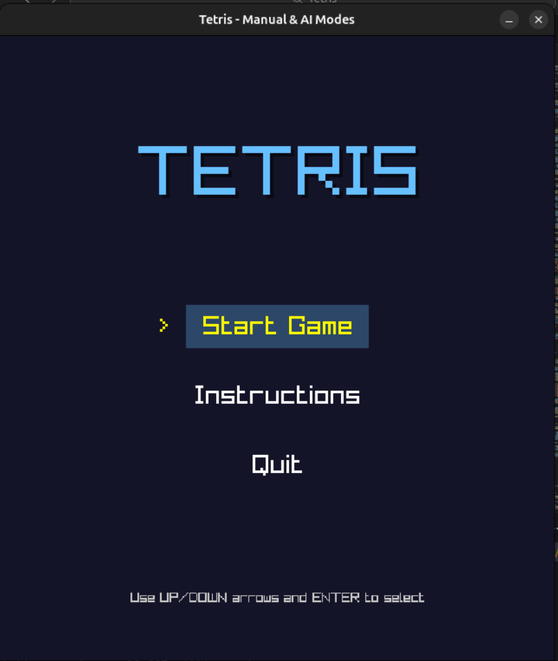
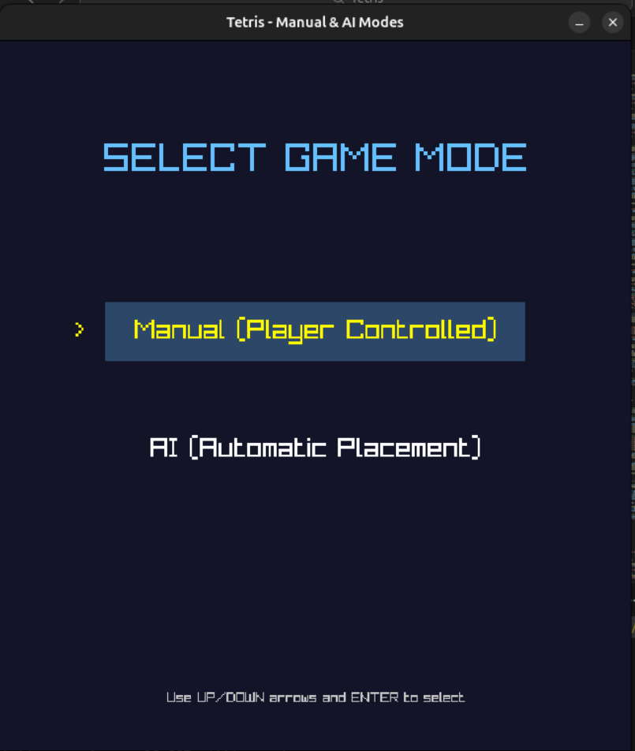
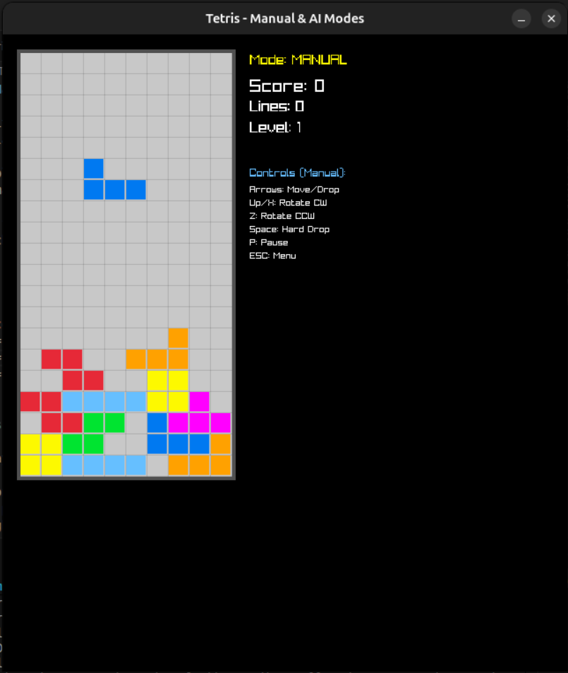

# Tetris (Manual & AI)

This repository contains a small, single-file Tetris implementation using raylib with two playable modes:

- Manual: player-controlled Tetris (controls similar to classic Tetris).
- AI: automatic placement using a heuristic evaluator (single-ply greedy placement).

The merged file `tetris_merged.cpp` provides a menu to choose between modes and retains much of the functionality from the original `tetris.cpp` (AI) and `exp.cpp` (manual).

---
<p align="center">
  
  
  
</p>

## Features

- 10x20 playfield using a 7-bag tetromino randomizer.
- Rotation, collision detection, line clear, scoring, and level speed-up.
- Manual controls: move, rotate, soft/hard drop, pause.
- AI mode: picks the best placement for the current piece using a heuristic (lines, holes, height, bumpiness).
- Simple UI with sidebar showing next piece and stats.

---

## Important files

- `tetris_merged.cpp`  — Merged game with Menu, Manual and AI modes (main file).
- `tetris.cpp`         — Original AI/heuristic implementation.
- `exp.cpp`            — Original manual, user-controlled implementation.
- `raylib/`            — Raylib source / build directory included in the workspace (if present).

---

## Build Instructions

You need `raylib` and a C++ compiler (g++ recommended).

Linux example (Ubuntu / other distributions):

```bash
# Install dependencies (example for Debian/Ubuntu):
sudo apt update
sudo apt install build-essential libraylib-dev libgl1-mesa-dev libx11-dev libasound2-dev libpulse-dev -y

# Compile
g++ -std=c++17 tetris_merged.cpp -o tetris_merged -lraylib -lGL -lm -lpthread -ldl -lrt -lX11

# Run
./tetris_merged
```

Windows (MSYS2) example:

```bash
# In MSYS2 / MinGW shell
g++ -std=c++17 tetris_merged.cpp -o tetris_merged.exe -lraylib -lopengl32 -lgdi32 -lwinmm
./tetris_merged.exe
```

If your system does not provide `libraylib` via package manager, install raylib from source or use the recommended build instructions on raylib's site: https://www.raylib.com/

---

## Controls (Manual Mode)

- Left / Right arrows: move piece
- Down arrow: soft drop
- Up arrow or X: rotate clockwise
- Z: rotate counter-clockwise
- Space: hard drop
- P: pause
- ESC: return to menu / exit

---

## AI Mode (current implementation)

- The AI in this repository is a single-ply greedy heuristic:
  - For every rotation and every horizontal placement the current piece can legally occupy, the AI "drops" the piece and evaluates the resulting board with a linear heuristic.
  - The heuristic uses weighted features: number of lines cleared, number of holes, aggregate column height, and bumpiness (column height differences).
  - The placement that yields the highest heuristic score is chosen and placed immediately.

---

<p align="center">
  Created by:
<p align="center">
	<a href="https://github.com/Husn-ur-rehman"></a>
	<a href="https://github.com/DanyalAbbas"></a>
	<a href="https://github.com/MoazzamFarooqui"></a>
